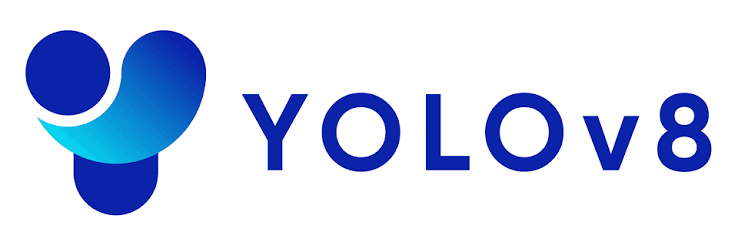
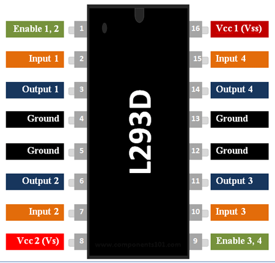
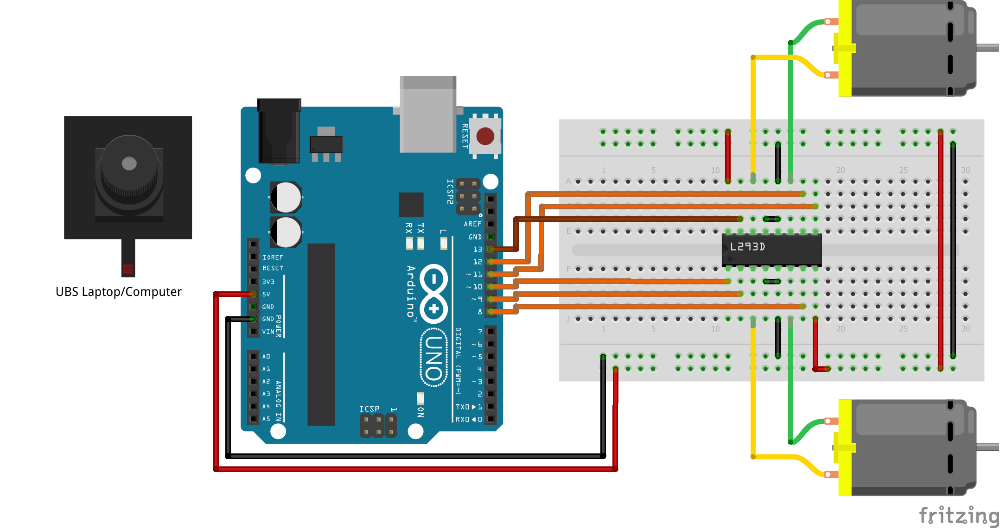

# Robot-Obstacle-Avoider-YOLOv8
A small autonomous robot using YOLOv8, OpenCV, and Arduino for real-time object detection and obstacle avoidance.

---

## 📑 List of Contents

- [Introduction](#-introduction)
- [Background & Key Concepts](#-background--key-concepts)
- [Design](#-design)
- [Program](#-program)
- [Results](#-results)

---

## 📌 Introduction

Obstacle avoidance is one of the fundamental problems in mobile robotics.
A robot needs to be able to detect objects in its environment and determine
an appropriate movement based on the detected obstacles.

In this project, a small mobile robot was developed using a **webcam,
Python-based computer vision, YOLOv8, and Arduino**.

The webcam captures the environment and the image is processed using
OpenCV and YOLOv8 to detect objects. The detection results are then used
to determine the robot's movement, while Arduino controls the motors.

The main goal of this project is to build a simple robot that can detect
objects in real time and respond by changing its movement.

---

## 🧠 Background & Key Concepts

### YOLOv8

  

YOLOv8 (You Only Look Once version 8) is a real-time object detection model developed by Ultralytics. It is designed to detect and locate objects in images or video by predicting their class, bounding box, and confidence score in a single inference process.

YOLOv8 is widely used in computer vision applications because of its balance between detection accuracy and computational efficiency. In this project, YOLOv8 is used to detect obstacles captured by a webcam, with the detection results serving as an input for the robot's obstacle avoidance system.

### Computer Vision

  

OpenCV (Open Source Computer Vision Library) is an open-source library used for image and video processing and computer vision applications. It provides various functions for capturing, processing, and analyzing visual data in real time.

In this project, OpenCV is used to capture video frames from the webcam, process the images, and display the object detection results generated by YOLOv8. This allows the robot to obtain visual information from its surroundings and use it for obstacle avoidance.

### Obstacle Avoidance

Obstacle avoidance is a fundamental capability in mobile robotics that allows a robot to detect objects in its environment and adjust its movement to prevent collisions. The system generally involves obstacle detection, distance or position estimation, and movement decision-making.

In this project, obstacle detection is performed using a webcam and YOLOv8 rather than conventional distance sensors. The detected object's position and estimated distance are used to determine whether the robot should move forward, turn left, or turn right to avoid the obstacle.

### Arduino UNO

  

Arduino Uno is a microcontroller board based on the ATmega328P microcontroller. It is commonly used in embedded systems and robotics because it can receive input signals, process commands, and control electronic components.

In this project, Arduino Uno acts as the motor control unit. It receives movement commands from the Python program through serial communication and sends control signals to the L293D motor driver to operate the robot's DC motors.

### IC L293D

  

L293D is a dual H-bridge motor driver IC designed to control the direction and movement of DC motors. It acts as an interface between a microcontroller and motors, allowing the motors to be controlled using logic signals from the microcontroller.

In this project, the L293D is connected to the Arduino Uno and DC motors. The Arduino sends control signals to the L293D, which then controls the direction of motor rotation, allowing the robot to move forward, backward, turn left, turn right, or stop.

---

## Design

  

### Hardware

| Component | Function |
|:---|:---|
| 🔵 **Arduino Uno R3** | Main microcontroller for robot control |
| ⚙️ **L293D Motor Driver** | Controls the DC motors |
| 📷 **Webcam** | Captures the environment for object detection |
| 🔄 **DC Gear Motors** | Drives the robot |
| 🛞 **Wheels** | Provides robot movement |
| ⚪ **Caster Wheel** | Supports robot balance and movement |
| 🔌 **Breadboard** | Prototyping and circuit connections |
| 🔗 **Jumper Wires** | Electrical connections |
| 🔋 **9V Battery** | Power supply |
| 🔋 **Powerbank** | Power supply for the system |

### Software & Libraries

| Software / Library | Purpose |
|:---|:---|
| 🐍 **Python** | Main programming language |
| 👁️ **OpenCV** | Image and video processing |
| 🎯 **YOLOv8** | Real-time object detection |
| 🔥 **PyTorch** | Deep learning framework |
| 🖐️ **CVZone** | Computer vision utilities |
| ⚡ **Arduino IDE** | Arduino programming and development |

---

## Programs

The program is divided into two main parts: the **Python program** for
computer vision, object detection, and movement decision-making, and the
**Arduino program** for controlling the robot's motors.

The Python program uses the webcam to capture the environment, processes
the image using [OpenCV](https://opencv.org/) and
[YOLOv8](https://github.com/ultralytics/ultralytics), and determines the
appropriate movement of the robot. The movement command is then sent to
the Arduino through serial communication.

The Arduino program receives the command and controls the DC motors
through the L293D motor driver.

### YOLOv8 Model

The project uses the **YOLOv8n** pretrained model.

The model file can be obtained from
[this repository](https://github.com/python-dontrepeatyourself/Real-Time-Object-Tracking-with-DeepSORT-and-YOLOv8/blob/657ab8eaebea118e5cee8c5b6ed9656e3aa03886/yolov8n.pt).
